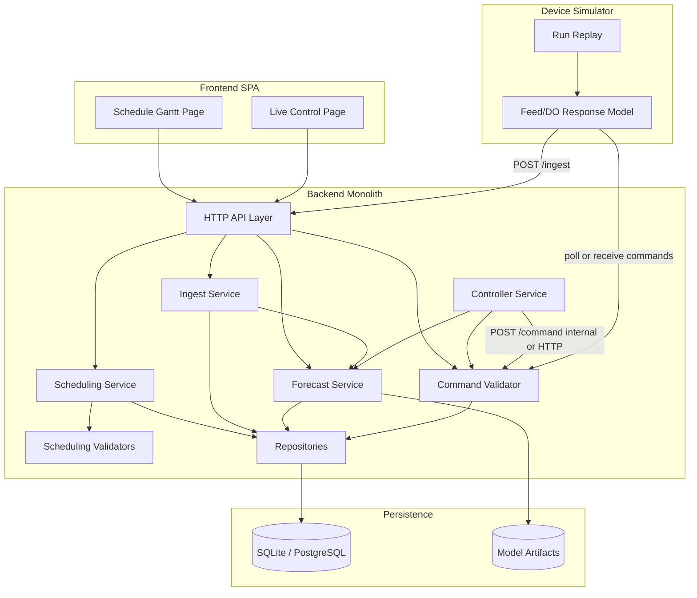
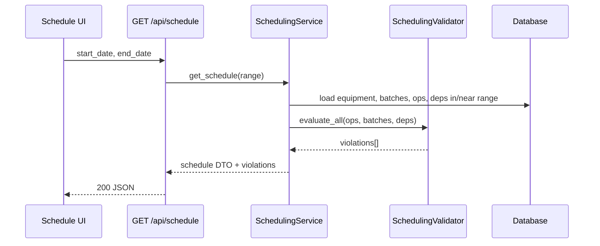
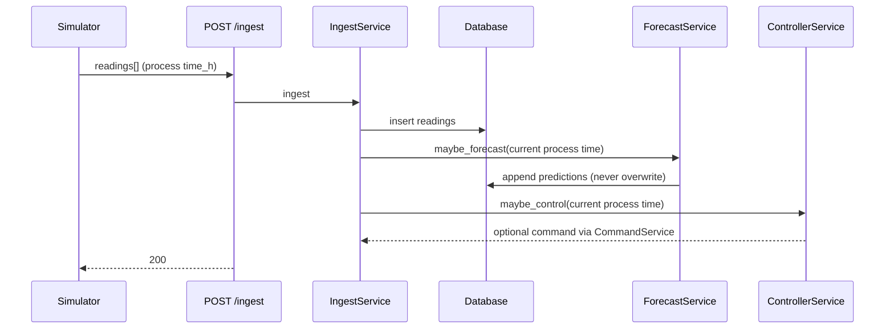
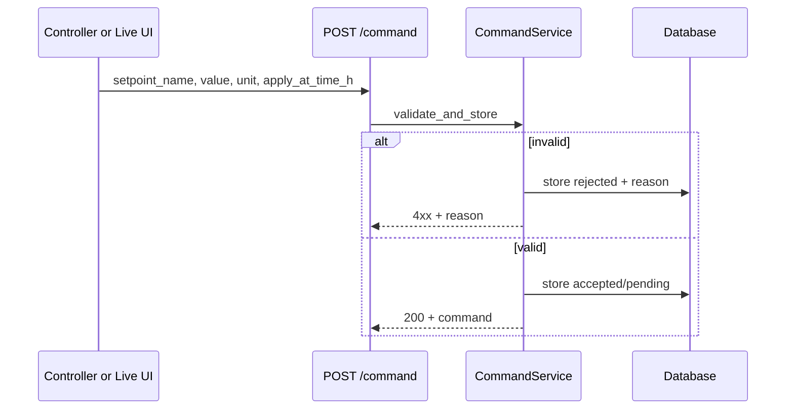
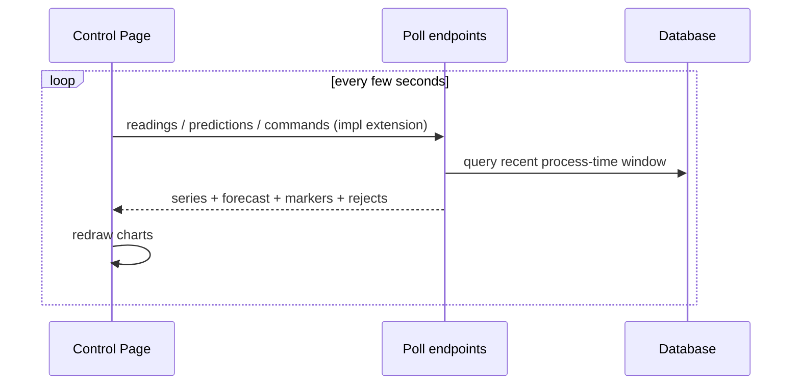

# Architecture

**Document ID:** `02-ARCHITECTURE`  
**Aligned with:** `01-PROJECT_SPEC.md`, assignment PDF  
**Style:** Modular monolith — proof of concept, not microservices  

---

## 1. Overview

A single deployable backend owns business rules, persistence, forecasting, and command validation. A React SPA provides the Schedule and Control UIs. A device simulator process (or in-process module) replays fermentation data and applies the feed response model, pushing readings to the ingest API and polling/receiving commands.



---

## 2. Principles

| Principle | Meaning |
|-----------|---------|
| Backend is authoritative | Scheduling rules and command validation live only in the backend |
| Modular monolith | Packages by concern; one process for PoC |
| Process time ≠ wall-clock | Separate fields; stamp readings/predictions/commands with process time |
| Predictions immutable | Append-only prediction history |
| Simple first | Prefer clear modules over premature distributed systems |
| Assignment wins | Conflicts with docs → update lower-level docs; never silently invent requirements |

---

## 3. Layer Responsibilities

### 3.1 Frontend

- Render Schedule Gantt and Live Control pages.
- Call backend APIs; display loading/error/empty states.
- Show violations returned by the backend; never re-implement DR-* rules as the source of truth.
- Desktop-first layout.

### 3.2 HTTP API layer

- Map HTTP ↔ DTOs (Pydantic).
- Status codes and error envelopes.
- No business rules beyond request shape validation.

### 3.3 Application / service layer

| Service | Responsibility |
|---------|----------------|
| SchedulingService | CRUD unit ops/batches (as needed); orchestrate validation; assemble schedule payload |
| SchedulingValidator | Enforce DR-001…DR-005; emit violation messages |
| IngestService | Persist readings; trigger forecast/controller hooks as designed |
| ForecastService | Build features from history; run model; persist predictions |
| ControllerService | Decide feed setpoint; respect lag/dwell/bounds via command path |
| CommandService | Validate and persist accept/reject; expose pending setpoints to simulator |

### 3.4 Data access

- Repositories / SQLModel sessions for Equipment, Batch, UnitOperation, Dependency, Reading, Prediction, ControlCommand.
- Alembic migrations for schema changes.

### 3.5 ML forecasting

- Isolated module behind a `Forecaster` interface (`predict(history) -> horizon`).
- Train/eval scripts separate from request path; load persisted artifact at runtime.
- Swappable implementations without changing ingest/controller contracts.

### 3.6 Device simulator

- Isolated process or module: replay CSV, apply response model each wall-clock tick, POST ingest, consume commands.
- Configurable replay speed; maintains current process time.

### 3.7 Testing

- Unit tests for domain rules and command validation (highest priority).
- API integration tests for schedule and ingest/command.
- Forecaster evaluation script vs baseline (not a UI test).

### 3.8 Deployment

- Hosted web app (assignment requires hosting; Docker not required).
- Design Decision / Implementation Choice: exact host (ADR-008 OPEN).

---

## 4. Module Boundaries (suggested layout)

```text
bbp-scheduling/
  backend/
    app/
      api/           # routes
      schemas/       # Pydantic DTOs
      services/      # application services
      domain/        # scheduling rules, command rules
      models/        # ORM
      ml/            # forecaster interface + impl
      db/            # session, migrations glue
    alembic/
    tests/
  frontend/
    src/
      pages/
      components/
      api/           # HTTP client only
      types/
  simulator/
    ...
  data_kit/          # provided runs (or symlink/copy)
  docs/
  .cursor/rules/
```

Exact package names are Design Decision / Implementation Choice; boundaries above are normative.

---

## 5. Dependency Direction

```text
api → services → domain
              → repositories → db
services → ml (interface)
simulator → HTTP APIs only (no direct DB writes preferred)
frontend → HTTP APIs only
```

Forbidden:

- Frontend importing domain validators as authority.
- Simulator writing predictions/commands tables directly (prefer APIs).
- ML module calling FastAPI routes in a cycle.

---

## 6. Major Flows

### 6.1 Schedule retrieval



### 6.2 Create / update unit operation

```mermaid
sequenceDiagram
  participant UI as Schedule UI
  participant API as POST/PUT unit_operations
  participant Svc as SchedulingService
  participant Val as SchedulingValidator
  participant DB as Database

  UI->>API: unit operation payload
  API->>Svc: create_or_update
  Svc->>Val: validate (incl. completed immutability)
  alt Reject-on-violation policy
    Val-->>Svc: violations
    Svc-->>API: 4xx + messages
  else Save-and-return policy
    Svc->>DB: persist
    Val-->>Svc: violations
    Svc-->>API: 200 + entity + violations
  end
  Note over Svc: Policy = ADR-005; must not silently succeed
```

### 6.3 Scheduling validation

- Input: candidate op + current schedule context (same batch ops, equipment occupancy, deps).
- Output: list of `{ rule_id, message, operation_ids[] }` with uniqueness: one entry per violating pair per rule.
- See `03-DOMAIN_RULES.md`.

### 6.4 Device reading ingestion



Exact trigger cadence (every ingest vs every N minutes process time) is Design Decision / Implementation Choice — document in `06-ML_CONTROL_SPEC.md`.

### 6.5 Forecast generation

1. Load last 60 process-minutes of DO and feed_rate.
2. If insufficient history → skip or mark unavailable (documented failure behavior).
3. Model outputs 10 values (t+1 … t+10 minutes).
4. Persist row(s) with `made_at_time_h` = current process time; never update prior rows.

### 6.6 Controller command generation

1. Read latest DO and/or forecast (reactive vs forecast-aware = E2 optional).
2. Propose setpoint within `[0.0, 30.0]` mL/h.
3. Respect dwell since last accepted command and 5-minute actuator lag semantics for apply time.
4. Submit through same validation path as manual commands.

### 6.7 Command validation



### 6.8 Device response

1. Simulator advances process time.
2. At/after `apply_at_time_h`, set `feed_rate` to setpoint until next command.
3. Integrate `dDO` first-order lag toward `-g*(feed_rate - feed_run)` each second; clamp DO.
4. Emit readings at 1 Hz wall-clock (each tick = configured process Δt).

### 6.9 Live dashboard update



Polling endpoints beyond `/ingest` and `/command` are **implementation extensions** (see `05-API_CONTRACT.md`).

---

## 7. Cross-Cutting Concerns

| Concern | Approach |
|---------|----------|
| Errors | Consistent JSON error envelope; distinguish validation, not found, conflict, invalid command, internal |
| Config | Env vars for DB URL, replay speed, model path, dwell minutes |
| Logging | Structured logs for ingest, forecast, command accept/reject |
| Time | Store process `time_h` (float hours) and wall-clock `created_at` (UTC timestamp) where useful |

---

## 8. What We Deliberately Avoid

- Microservices / message buses for PoC.
- Duplicating DR-* rules in React.
- Overwriting prediction history.
- Coupling controller to a specific ML library API (use interface).
- Implementing optional E1–E4 before mandatory acceptance criteria pass.

---

## Document control

| Version | Date | Notes |
|---------|------|-------|
| 0.1 | 2026-09-29 | Initial architecture for PoC |
