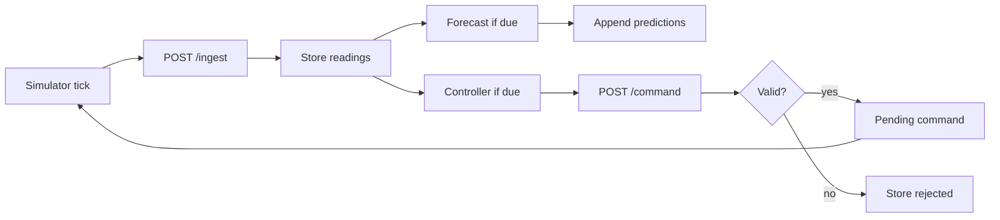

# ML and Closed-Loop Control Specification

**Document ID:** `06-ML_CONTROL_SPEC`  
**Source:** Assignment Part C + §3 Data and contracts + `data_kit/`  

---

## 1. Data

### 1.1 Provided runs

| File | Description |
|------|-------------|
| `data_kit/run_A.csv` | ~40 h fermentation, 1 row per process-minute per signal |
| `data_kit/run_B.csv` | same shape |
| `data_kit/run_C.csv` | same shape |
| `data_kit/limits.json` | feed bounds |

**Columns:** `time_h,signal_name,value,unit`  

**Signals:**

| signal_name | unit | Notes |
|-------------|------|-------|
| DO | % | Dissolved oxygen |
| pH | - | |
| temp | degC | |
| feed_rate | mL/h | |

Runs are complete (every minute has all four signals). Signal names are anonymized per data_kit README.

### 1.2 Limits

```json
{"feed_rate": {"unit": "mL/h", "min": 0.0, "max": 30.0}}
```

### 1.3 Synthesis alternative

Assignment allows synthesizing runs in the same shape (DO starts near 100%, falls as culture grows, drops further when feed rises). If used, document in README. **Default plan:** use provided `run_A/B/C`.

---

## 2. Process Time

| Concept | Definition |
|---------|------------|
| Process time | Hours from inoculation (`time_h`), independent of wall-clock |
| Wall-clock time | Real elapsed time / server timestamps |
| Replay speed | Maps wall-clock Δt → process Δt (configurable) |
| Default speed | 1 process-minute per wall-clock second (sensible default per assignment) |

Stamp **readings**, **forecasts**, and **commands** with process time. Never use wall-clock for lag, dwell, or forecast horizon math.

---

## 3. Device Simulator

### 3.1 Responsibilities

- Replay a chosen run CSV.
- Emit DO, pH, temperature, feed_rate **once per wall-clock second** (assignment: once per second).
- Accept feed-rate commands and apply response model.
- Maintain **current process time**.
- Push readings via `POST /ingest`.
- Obtain pending commands (poll API or shared store — Design Decision / Implementation Choice; prefer API for isolation).

### 3.2 Configurable replay

- Speed multiplier / process-minutes per wall-clock second.
- Optional start offset into the run (for demos).
- For recording, may run faster than default.

### 3.3 Feed and DO response (assignment §3)

Command applied at process time `t0`:

1. **Feed:** `feed_rate(t) = setpoint` for all `t >= t0` until the next command.
2. **DO:** `DO(t) = DO_run(t) + dDO(t)`, where `dDO` follows a first-order lag toward:

   ```text
   target_dDO = -g * (feed_rate(t) - feed_run(t))
   ```

   with:

   - `tau = 5` process-minutes  
   - `g = 2.0` %DO per mL/h  
   - Clamp `DO` to `[0, 100]`

3. Implement as a **simple step each second**. Document any deviation.

**Discrete lag step (chosen):**

```text
dDO <- dDO + (dt_proc_minutes / tau) * (target_dDO - dDO)
```

Implemented in `simulator/bbp_simulator/response_model.py`.
### 3.4 Actuator lag

Controller must respect **5-minute actuator lag**: commands should be scheduled such that apply time accounts for lag (set `apply_at_time_h` ≥ current process time + 5/60 h when modeling lag, or equivalent documented policy). Assignment groups lag with controller constraints; exact scheduling of `apply_at_time_h` is Design Decision / Implementation Choice but must be consistent and documented.

### 3.5 Isolation

Simulator must not bypass command validation or write predictions directly.

---

## 4. Data Ingestion

- Endpoint: `POST /ingest` (see `05-API_CONTRACT.md`).
- Persist each reading with process `time_h` and wall-clock `created_at`.
- After ingest, optionally trigger forecast and/or controller (cadence: Design Decision / Implementation Choice — e.g., every process minute when new minute bucket closes).

---

## 5. Forecasting

### 5.1 Interface

```text
Inputs:
  - last 60 minutes of DO (process time)
  - last 60 minutes of feed rate

Output:
  - next 10 minutes of DO
  - 1-minute resolution (10 points)
```

### 5.2 Model choices (allowed)

GRU, LSTM, linear, gradient boosting, or another justified approach.  

**Strategy:** implement a `Forecaster` protocol; start with a simple model; only increase complexity if baseline gap justifies it (ADR-007 ACCEPTED: Ridge linear).

### 5.3 Swappability

```text
Forecaster
  ├── PersistenceBaselineForecaster  (repeat last DO)
  ├── LinearForecaster
  ├── GradientBoostingForecaster
  └── SequenceForecaster (GRU/LSTM)
```

Controller and UI depend only on the interface + stored predictions.

---

## 6. Baseline

**Persistence baseline:** repeat the last observed DO value across the 10-minute horizon.

Every reported model metric must be shown **next to** this baseline.

---

## 7. Evaluation

### 7.1 Split strategy

Assignment: which runs train vs hold out is **your decision**; say what you chose in README.

**Proposed (Design Decision / Implementation Choice — finalize in README after experiments):**

| Split | Runs |
|-------|------|
| Train | e.g. `run_A`, `run_B` |
| Hold-out test | e.g. `run_C` |

Optional internal validation slice from train runs (time-based) — Design Decision / Implementation Choice.

### 7.2 Metric

Assignment says “report the error” without naming MAE vs RMSE.  

**Design Decision / Implementation Choice:** primary metric **MAE** (%DO) over the 10-step horizon on held-out run(s); also report RMSE optional. Compare model vs persistence baseline on the same points.

### 7.3 Reproducibility

- Fix random seeds where applicable.
- Persist model artifact + version string on predictions.
- Evaluation script runnable offline from `data_kit`.

### 7.4 Model persistence

Save artifact under versioned path (e.g. `backend/app/ml/artifacts/`). Load at API startup or first forecast.

---

## 8. Controller

### 8.1 Role

Emit feed setpoints to keep DO healthy. **Rule-based is acceptable if justified.** Closed loop > model sophistication.

### 8.2 Constraints

| Constraint | Requirement |
|------------|-------------|
| Feed bounds | `[0.0, 30.0]` mL/h |
| Actuator lag | 5 process-minutes |
| Dwell time | Minimum process-time gap between commands — **value not specified by assignment** → Design Decision / Implementation Choice (e.g. 5 process-minutes); document in README |
| Validation | All commands go through backend validator |

### 8.3 Policy (initial plan)

**Reactive rule (mandatory path):** e.g. if DO below threshold, decrease feed; if DO high and feed high, etc. Exact thresholds = Design Decision / Implementation Choice.

**Forecast-aware (E2, optional):** act on forecast ~one lag ahead; deferred until mandatory done.

### 8.4 Command scheduling

Set `apply_at_time_h` respecting current process time and lag policy; `source=controller`.

---

## 9. Command Validation

Validate every command (controller or person). Reject with reason when:

| Check | Condition |
|-------|-----------|
| Bounds | `value` not in `[min, max]` for setpoint |
| Time | `apply_at_time_h` < device current process time |
| Unit | `unit` does not match expected (`mL/h` for feed_rate) |
| Pending | another command for the **same setpoint** still pending |

Persist rejects with `reject_reason`; show on live page.

---

## 10. Closed-Loop Execution



Loop success criteria for demo: readings arrive → forecast drawn → command sent → device feed/DO respond.

---

## 11. Prediction Storage

- Store with **process time made at** (`made_at_time_h`).
- Store each horizon point (`target_time_h`, value).
- **Never overwrite** historical predictions.
- Latest forecast for UI = rows with max `made_at_time_h` (for DO).

---

## 12. Failure and Missing-Data Behavior

| Situation | Behavior (Design Decision / Implementation Choice — lock before Phase 8) |
|-----------|--------------------------------------------------------------------------|
| < 60 minutes history | Skip forecast; UI shows “forecast unavailable” |
| Stale forecast | Define max age in process-minutes (e.g. > 2); controller may fall back to reactive; UI marks stale |
| Model load failure | Fall back to persistence baseline for live loop continuity; log error |
| Ingest gap | Controller uses last known reading; do not invent samples without documenting |
| Missing feed history | Same as insufficient history — skip or baseline-only |

Assignment E2 explicitly asks to reason about stale/missing forecasts for forecast-aware control; for base reactive controller, still document stale forecast display on live page.

---

## Document control

| Version | Date | Notes |
|---------|------|-------|
| 0.1 | 2026-09-29 | Initial Part C spec |
